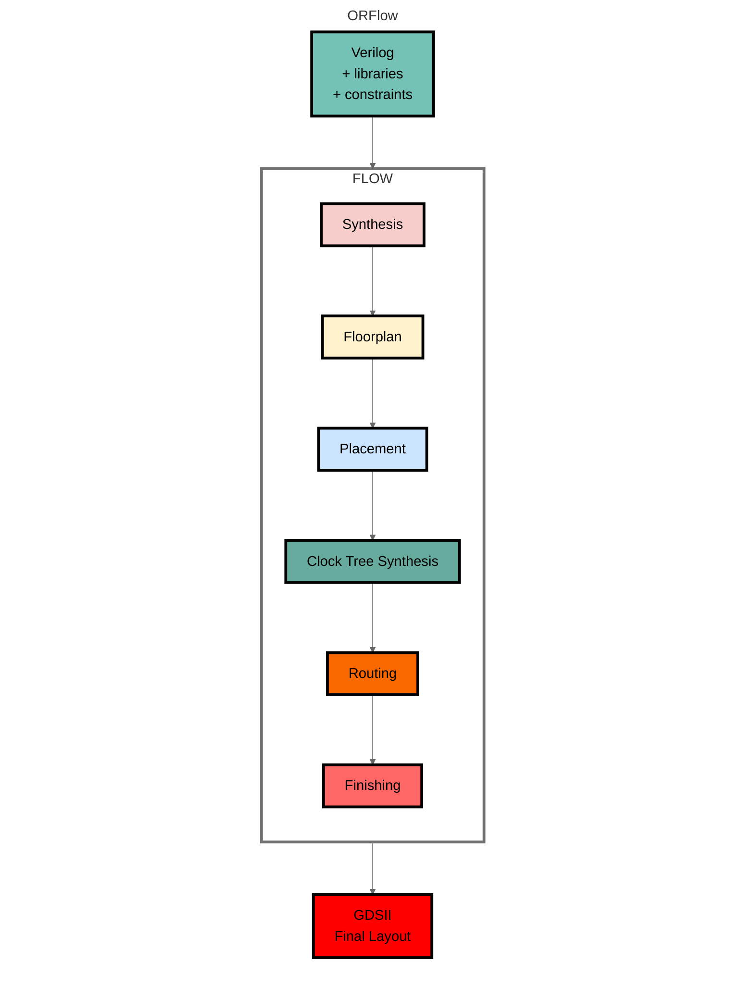
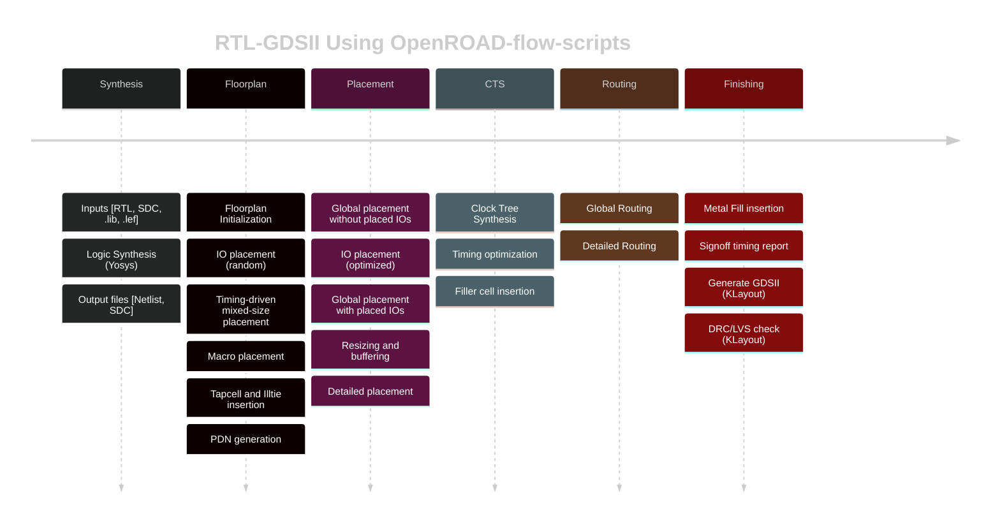

# Lab Report

## 1. Lab 0: Overall Understanding of the Digital Design Flow

In Lab 0, I gained a comprehensive understanding of the standard digital design implementation flow using open-source EDA tools. The main stages of the RTL-to-GDSII flow include:

- **Synthesis**: Converting RTL code (typically written in **Verilog**) into a gate-level netlist using logic synthesis tools (typically **Yosys**).
- **Floorplanning**: Defining the chip layout boundaries, core utilization, macro placements, and poIr planning.
- **Placement**: Automatically placing standard cells within the defined floorplan while optimizing for congestion and timing.
- **Clock Tree Synthesis (CTS)**: Generating and balancing the clock distribution network to meet timing constraints and minimize clock skew.
- **Routing**: Connecting placed cells and macros using metal layers while adhering to design rules.
- **Finishing**: Performing final optimizations including layout verification, parasitic extraction, and DRC/LVS checks.



Through Lab 0, I learned how to run the full OpenROAD flow script, understood the purpose and impact of various configuration parameters, and observed how changes in these parameters affect physical implementation results. In particular, I explored:

- How to modify flow configuration files to adjust design parameters.
- The use of the `OpenROAD` GUI to visualize different stages of the design process.
- How to analyze timing reports, critical paths, and congestion maps.
- How to generate and interpret heatmaps to assess placement density and routing congestion.
- How to review final GDSII output and validate design quality metrics.

This lab provided a high-level overview of the entire RTL-to-GDSII pipeline and gave us hands-on experience with both command-line and graphical interfaces, laying the foundation for deeper exploration in subsequent labs.

For detailed instructions on running the flow and explanations of the configuration parameters, please refer to my [note](./Lab%200/Lab%200-note.md) and

[Lab 0 report](./Lab%200/submitting/ECE%20260C%20Lab%200.pdf).

Figure below shows the main stages of the OpenROAD-flow-scripts:



During the lab, I also identified and fixed two bugs that affected the correctness and stability of the flow. These issues are most likely caused by version mismatches betIen different components of the toolchain, which is a common challenge when working with open-source EDA tools.

```bash
# Error1
[ERROR STA-0562] repair_timing -sequence is not a known keyword or flag.
Error: floorplan.tcl, 110 STA-0562
# 修复 scripts/util.tcl
  if { $::env(HOLD_SLACK_MARGIN) < 0 } {
    append_env_var additional_args HOLD_SLACK_MARGIN -hold_margin 1
  }
  # append_env_var additional_args SETUP_MOVE_SEQUENCE -sequence 1 # 注释改行
  append_env_var additional_args TNS_END_PERCENT -repair_tns 1
  append_env_var additional_args SKIP_PIN_SWAP -skip_pin_swap 0
# ...

# Error2
[ERROR STA-0562] clock_tree_synthesis -repair_clock_nets is not a known keyword or flag.
Error: cts.tcl, 35 STA-0562
# 修复 scripts/cts.tcl
# Run CTS
set cts_args [list \
  -sink_clustering_enable \
  -balance_levels]
  # -repair_clock_nets  # 去除 -repair_clock_nets 选项
```

## 2. Lab 1: Synthesis & Technology Mapping & Design Space Exploration  

Lab 1 focused on understanding the fundamental processes of logic synthesis and technology mapping, particularly how a design evolves as it transitions from high-level behavioral descriptions to low-level gate representations. The lab emphasized practical and methodological approaches for early-stage design space exploration, enabling the identification of high-quality design candidates without committing to the full RTL-to-GDSII flow.

### Motivation and Scope

In modern digital design, iterating through the full backend flow is computationally expensive and time-consuming. Therefore, performing early evaluations at the synthesis-only stage—where optimization, transformation, and technology mapping occur—offers an efficient means to prune unpromising candidates before physical implementation.

In this lab, I used the ABC synthesis tool to perform logic optimization and technology mapping. The workflow excluded backend stages such as placement, clock tree synthesis, and routing. This streamlined setup alloId us to iterate quickly, test hypotheses, and gain immediate feedback from the synthesis results.

### Scientific Methodologies

The design space exploration in Lab 1 adopted several common scientific strategies:

1. **Control of Variables**: 

   I established mathematical relationships among multiple variables and varied only one parameter at a time (**N_CYCLES**). This allowed us to isolate and quantitatively evaluate the impact of each individual parameter on performance and area metrics.

2. **Measurement and Evaluation**:

   I gathered quantitative data (typically **PPA**, area and frequency in this case) and used these metrics to evaluate each configuration. Trade-offs among power comsuption, performance, and area (PPA) are considered to identify balanced solutions.

3. **Iterative Refinement**:

   Based on the results, I refined our parameter sets and re-ran synthesis with targeted adjustments. This cycle of prediction, testing, and refinement aligns closely with standard scientific inquiry.

### Outcomes and Insights

Through this structured exploration process, I identified multiple candidate designs that offered different PPA trade-offs. For example, one configuration minimized area with acceptable timing, while another improved frequency ($f_{max}$) with a modest area increase. These trade-offs are critical in real-world designs where the final choice depends on product requirements and system-level constraints.

Ultimately, this lab illustrated that:

- **Early-stage exploration using synthesis tools is a poIrful low-cost strategy** for identifying viable design directions.
- **Applying structured, scientific reasoning in EDA flows can significantly reduce iteration time and improve decision quality.**

A bug fixed in RTL, see [State Machine Encoding Error in asqrt_pipe · Issue #1 · UDXS/ece260c-lab1-starter](https://github.com/UDXS/ece260c-lab1-starter/issues/1)

## 3. Lab 2: Scripting with OpenDB – Direct Database Manipulation via Python

Lab 2 introduced scripting capabilities for physical design using the OpenDB Python API, which allows users to access and manipulate the internal database of the OpenROAD toolchain. This lab emphasized building intuitive and practical understanding of the database structure and how to use Python for custom layout operations.

I aimed to move beyond GUI-based design tools and experiment, enabling programmable, repeatable, and fine-tuned physical modifications to digital designs.

### Objectives and Achievements:

- **Explored OpenDB’s data model**:

  Understood core components such as `dbBlock`, `dbInst`, and their interrelations within the layout database.

- **Scripted layout modifications**:

  Implemented Python scripts to manipulate instance placement (adjusting `x`, `y` coordinates), enforce row-based constraints and analyze connectivity information, directly in the layout database.

- **Verified changes through the GUI**:

  After making database modifications via Python, used OpenROAD GUI to visualize and validate the impact on layout.

### Key Learning Strategies:

1. **Overcame Limited Documentation** (unable to RTFM/STFW):

   Faced with sparse official documentation, "learn by doing". Used `dir()`, `help()` functions, and tab-completion in the Python shell to explore classes and methods interactively.

2. **Reverse-Engineered Usage Patterns**:

   - Studied example scripts from the OpenROAD project and community forums.
   - Mimicked common scripting idioms to understand best practices for traversing and modifying the layout database.

3. **Practiced Systematic Exploration**:

   - Isolated simple use cases (e.g., move a single cell).
   - Gradually scaled to more complex modifications.

4. **Developed Debugging Heuristics**:

   Handled common issues such as invalid references or coordinate mismatches through assertions and visualization.

## Conclusion

During this project, I enhanced my **self-learning abilities** by independently exploring various open-source EDA tools and analyzing their documentation and source code. Through systematic **data exploration**, I investigated multiple design parameters to understand their impact on performance and area metrics. I gained hands-on experience with key **EDA tools**, improving my proficiency in synthesis, floorplanning, and etc. This process also deepened my understanding of fundamental and advanced **EDA concepts**, laying a strong foundation for further study and practical application in chip design workflows.
